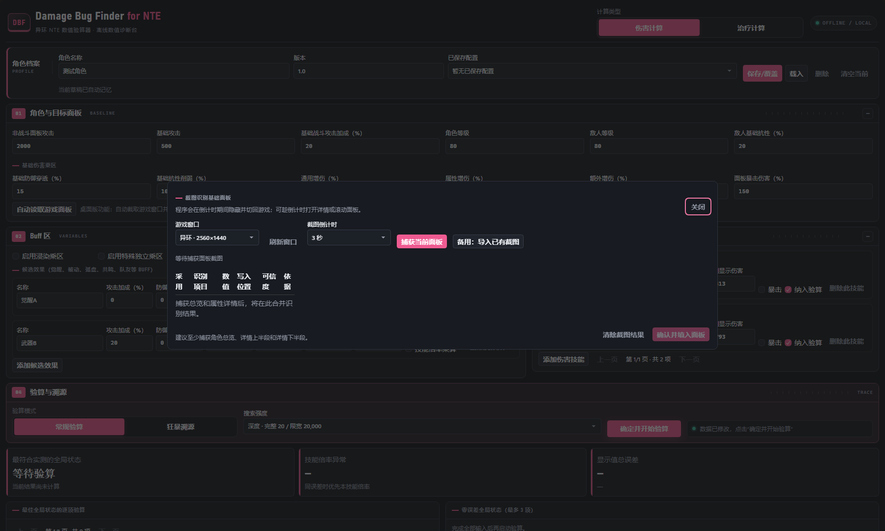

# Damage Bug Finder for NTE / 异环 NTE 数值验算器

一款面向《异环》数值测试与 Bug 排查的完全离线工具。

它可以按已知公式正向计算伤害与治疗，也可以把实测跳字交给多组“生效 / 失效”假设反向验算，找出最能同时解释整批数据的 Buff 状态、技能倍率和伤害来源。


## 核心能力

| 场景 | 可以完成的工作 |
| --- | --- |
| 正向计算 | 计算常规伤害、暴击伤害、创生花伤害和治疗值，同时保留内部小数。 |
| 常规验算 | 已知技能来源时，判断基础乘区、觉醒、武器、弧盘、共鸣或队友 Buff 是否实际生效。 |
| 狂暴溯源 | 面对一批不知道来源的跳字，反推技能、暴击状态、倍率来源及共同 Buff 状态。 |
| 倍率排错 | 记录多个技能倍率，检查技能是否误用了其他技能的倍率。 |
| 档案保存 | 按“角色名称 + 游戏版本”保存完整配置，并自动记忆当前草稿。 |
| 面板 OCR | 桌面版自动截取游戏窗口，使用 Windows 本机 OCR 读取基础面板，不上传截图。 |

## 下载与运行

### Windows 桌面版（推荐）

从仓库的 [Releases](../../releases/latest) 下载：

```text
DamageBugFinderForNTE-v0.6.0-Windows-x64.zip
```

完整解压后运行：

```text
DamageBugFinderForNTE\DamageBugFinderForNTE.exe
```

不要直接在 ZIP 中运行，也不要只复制 EXE。程序需要同目录的 `_internal` 文件夹。

桌面版不要求安装 Python，基础计算不联网；OCR 需要 Windows 10/11 的简体中文 OCR 语言组件。若 Windows 弹出未知发布者提示，可在确认文件来自本仓库后选择“更多信息 → 仍要运行”。

### 单文件 HTML 版

直接下载并双击仓库根目录的 `index.html`。它支持计算、验算、狂暴溯源和浏览器本地档案，但不支持自动捕获游戏窗口及 Windows OCR。

`index.html` 也是静态站点入口，可直接部署到 GitHub Pages 或其他静态托管服务。

## 四步工作流

界面中的编号对应真实操作顺序：

1. `01 BASELINE`：填写角色、目标和基础乘区。
2. `02 VARIABLES`：加入可能生效或失效的 Buff。
3. `03 OBSERVED`：录入技能倍率及游戏实测值。
4. `04 TRACE`：选择验算模式和搜索强度，开始排查。


顶部的“伤害计算 / 治疗计算”会切换整套输入界面。角色档案按角色和版本归档；“保存/覆盖”保存当前全部字段，“清空当前”只清空草稿，不会删除已保存档案。

## 使用场景

### 常规验算：已知是哪一个技能

适合确认某次攻击是否正确吃到了指定觉醒、武器或其他 Buff。

1. 填写角色与敌人面板。
2. 在 Buff 区加入所有可能生效的效果。
3. 添加一个或多个伤害技能，填写倍率、暴击状态和实测显示伤害。
4. 选择“常规验算”，通常保持“深度”搜索。
5. 点击“确定并开始验算”。


程序会把同一个候选状态应用于本批全部实测值，最上方是排序第一的全局解释。只有整批显示值总误差为 `0` 的备选状态，才会进入“零误差全局状态”列表。

### 狂暴溯源：只看到一批未知跳字

适合实战中同时出现多段伤害、无法确认每个数字来源的情况。

1. 先录入角色、目标、Buff 和所有可能的技能倍率。
2. 勾选需要加入来源池的技能。
3. 切换到“狂暴溯源”。
4. 将未知伤害用空格、逗号、分号或换行批量粘贴。
5. 点击“确定并开始溯源”。


每条未知伤害都会尝试候选技能、创生花、暴击 / 非暴击和其他已记录倍率。同一来源允许重复，但整批跳字必须共享同一套面板与全局 Buff 状态。

程序只汇报显示值误差在 `±20` 内的来源。相差几十或几百的结果不会被强行解释。

### 治疗验算

切换到“治疗计算”后，敌人、防御、抗性、增伤、浸染和特殊独立乘区会隐藏，只显示治疗需要的攻击、治疗加成、候选 Buff 和治疗技能。


治疗 Buff 与伤害 Buff 使用相同的生效 / 失效验算逻辑。

### 自动读取游戏面板（仅桌面版）

点击“角色与目标面板”中的“自动读取游戏面板”即可打开 OCR 工具。



推荐捕获三次：

1. 角色信息总览；
2. 属性详情上半段；
3. 滚动后的增伤与属性区域。

选择游戏窗口和倒计时后点击“捕获当前面板”。计算器会暂时隐藏并切回游戏；可趁倒计时打开详情或滚动面板。多张截图会按字段名称合并去重，确认识别值后再写入计算器。

当前可自动填写：

- 非战斗面板攻击与基础攻击；
- 角色等级；
- 面板暴击伤害；
- 通用增伤；
- 光、灵、咒、暗、魂、相、心灵七种属性中的有效属性增伤；
- 环合强度；
- 治疗加成。

暴击伤害按游戏面板原值导入。例如 OCR 读到 `134%` 时填入 `134`，计算时自动转换为 `1 + 134% = 2.34` 倍。

生命、防御、体力、暴击率、充能效率、倾陷强度及受治疗加成不会写入计算器；敌人等级、敌人抗性、防御穿透和抗性削弱仍需手动填写。截图与识别均在本机完成，程序不会保存完整截图，也不会导入画面中的 UID。

## 字段填写规则

### 角色档案

| 字段或操作 | 规则 |
| --- | --- |
| 角色名称 | 与版本共同组成档案键，建议使用游戏内角色名。 |
| 版本 | 建议填写可复现的游戏版本，例如 `1.4.0`。 |
| 保存/覆盖 | 保存面板、Buff、技能、模式和搜索强度；同名档案会覆盖。 |
| 载入 | 使用所选档案替换当前输入。 |
| 删除 | 永久删除所选本地档案。 |
| 清空当前 | 清空当前草稿，保留已保存档案。 |

未主动保存时，程序仍会自动记忆当前草稿。

### 01 · 角色与目标面板

| 字段 | 单位与填写方式 |
| --- | --- |
| 非战斗面板攻击 | 填角色未进入战斗时的最终面板攻击。不要预先加入战斗 Buff。 |
| 基础攻击 | 填属性详情中攻击力左侧的白色基础数值。 |
| 基础战斗攻击加成 | 填百分数；`20` 代表 `20%`。 |
| 基础治疗加成 | 仅治疗模式显示，填游戏面板百分数。 |
| 角色等级、敌人等级 | 填整数，进入防御区公式。 |
| 敌人基础抗性 | 填百分数。敌人属性抗性可参考[敌人数据表一](https://docs.qq.com/sheet/DUGxzWGhNc2RsZ3B0?tab=dfjfo3)和[敌人数据表二](https://docs.qq.com/sheet/DUFFaVGFDRmxaRUF6?tab=000001)。 |
| 基础环合强度 | 非战斗面板值，合法范围 `0～360`；只有创生花或浸染需要时显示。 |

基础伤害乘区也位于 `01` 面板区内：

| 字段 | 规则 |
| --- | --- |
| 防御穿透 | 填 `20` 即按 `0.20` 进入防御区。 |
| 抗性削弱 | 与抗性区加算。 |
| 通用 / 属性 / 额外增伤 | 三者与基础倍率 `1` 加算形成增伤区。 |
| 面板暴击伤害 | 直接填写游戏显示百分数，程序自动补基础倍率 `1`。 |
| 浸染乘区 | 启用后常规伤害乘 `1.2 × 最终环合强度 / 600`。 |
| 特殊独立乘区 | 启用后直接填写倍率，例如 `1.2`。 |

反向验算不仅会检查整个基础乘区是否失效，也会检查其中单个基础数值是否未生效。

### 02 · Buff 区

候选效果包括觉醒、被动、弧盘、共鸣、队友等 Buff。每一行代表一个可独立判断生效或失效的效果。

| 字段 | 进入的计算位置 |
| --- | --- |
| 攻击加成 | 与其他攻击加成相加，再乘基础攻击后加入战斗面板。 |
| 防御穿透 | 加入防御穿透总和。 |
| 抗性削弱 | 加入抗性削弱总和。 |
| 增伤 | 加入 `1 + 通用 + 属性 + 额外 + Buff` 增伤区。 |
| 暴击伤害 | 与面板暴击伤害加算，不会再次增加基础倍率 `1`。 |
| 技能倍率 | 默认与技能基础倍率加算。 |
| 技能倍率乘算 | 勾选后改为 `基础倍率 × (1 + 提升)`；多个乘算项连乘。 |
| 环合强度提升 | 百分比提升，先乘基础环合强度。 |
| 环合强度固定提升 | 在百分比提升后加固定数值 `+x`。 |
| 治疗加成 | 加入治疗加成区，仅治疗模式显示。 |

同一行填写多个提升，表示这些提升共享该行的整体生效条件。程序仍会继续检查行内单项是否未生效。数值为 `0` 的字段不会形成独立判断项。

### 03 · 技能与实测值

伤害技能字段：

| 字段 | 规则 |
| --- | --- |
| 技能名称 | 自定义名称，建议与游戏内名称一致。 |
| 伤害模型 | “常规”读取攻击和各伤害乘区；“创生”使用固定基础值 `9000`。 |
| 基础倍率 | 填百分数，例如 `240` 代表 `2.40` 倍；创生花不读取此值。 |
| 实测显示伤害 | 填游戏最终显示的整数。 |
| 暴击 | 常规验算时指定该条实测值是否暴击。 |
| 作为候选来源 | 决定该技能是否进入狂暴溯源来源池。 |

可以记录多个技能。常规验算优先使用本技能倍率，也会尝试其他已记录倍率，以排查“误用其他技能倍率”的问题。

治疗技能只需要名称、治疗倍率和实测显示治疗。

## 计算公式

### 战斗攻击

```text
战斗攻击
= 非战斗面板攻击
+ 基础攻击 × 生效攻击加成总和
```

来自觉醒、武器、弧盘、共鸣和队友的攻击加成都包含在这里。

### 防御、抗性与增伤区

```text
防御区
= (100 + 角色等级)
  / [(100 + 角色等级) + (100 + 敌人等级) × (1 - 防御穿透)]

抗性区
= 1 - 敌人基础抗性 + 抗性削弱

增伤区
= 1 + 通用增伤 + 属性增伤 + 额外增伤 + 生效 Buff 增伤
```

### 常规伤害

```text
非暴击伤害
= 战斗攻击 × 防御区 × 抗性区 × 增伤区 × 最终技能倍率
  × 浸染乘区（若启用）
  × 特殊独立乘区（若启用）

暴击伤害
= 非暴击伤害 × 暴击伤害倍率

暴击伤害倍率
= 1 + 面板暴击伤害 + 生效 Buff 暴击伤害
```

### 环合强度、浸染与创生花

```text
最终环合强度
= 非战斗基础环合强度 × (1 + 百分比提升总和)
  + 固定数值提升总和

浸染乘区
= 1.2 × 最终环合强度 / 600

非暴击创生花
= 9000 × 防御区 × 抗性区 × (1 + 最终环合强度 / 600)

暴击创生花
= 非暴击创生花 × 暴击伤害倍率
```

浸染和特殊独立乘区不作用于创生花。创生花也不读取面板攻击、常规增伤区或普通技能倍率。

### 治疗

```text
治疗值
= 战斗攻击 × 治疗倍率 × (1 + 生效治疗加成总和)
```

伤害技能的防御、抗性、增伤、暴击、浸染和特殊独立乘区均不作用于治疗。更完整的加算、乘算和失效规则见 [docs/formulas.md](docs/formulas.md)。

## 如何理解验算结果

“最符合实测的全局状态”是整批实测值共同使用的一套解释，不是统计学概率，也不是单条伤害的来源。

状态按以下顺序排序：

1. 超过 `±20` 或没有来源的条目更少；
2. 相对误差总和更小；
3. 基础乘区失效更少；
4. 误用其他技能倍率更少；
5. 候选 Buff 失效更少。

| 结果字段 | 含义 |
| --- | --- |
| 理论精确值 | 保留小数的内部计算值。 |
| 理论显示值 | 按游戏显示规则四舍五入后的整数。 |
| 误差 | `|理论显示值 - 实测显示值|`。 |
| 显示值总误差 | 本批全部条目的显示值误差之和。 |
| 零误差全局状态 | 整批总误差为 `0` 且没有无来源条目的状态，最多显示 3 项。 |
| ±20 内来源数 | 当前全局状态下，某条未知伤害落入误差范围的候选来源数量。 |

如果没有零误差状态，顶部仍显示总体最接近的状态用于诊断，但不会把带误差的备选状态列入“零误差全局状态”。

## 搜索范围与性能

| 档位 | 完整枚举上限 | 超过上限后的限宽 | 建议用途 |
| --- | ---: | ---: | --- |
| 标准 | 18 个判断项，最多 262,144 个状态 | 5,000 | 快速反复改数值。 |
| 深度 | 20 个判断项，最多 1,048,576 个状态 | 20,000 | 默认正式验算。 |
| 极限 | 22 个判断项，最多 4,194,304 个状态 | 50,000 | 最终排查，接受更长等待。 |

完整枚举范围内会评估全部 `2^N` 个状态。为了控制内存，计算过程中只保留排序最好的 300 个解释，这不会改变第一名和前三个零误差结果。

超过上限后，程序会从“全部生效”开始逐项排除，并保留当前较好的路径。该模式不是穷举，理论上可能漏掉组合；界面会明确标注当前采用“完整枚举”还是“全生效起点逐项排除”。

EXE 仍使用 JavaScript 计算。打包不会消除数百万状态带来的计算量；极限档或复杂狂暴溯源期间窗口可能短暂忙碌，请等待状态栏显示“验算完成”或“溯源完成”。

## 数据保存与隐私

全部计算、档案和 OCR 都在本机完成。

| 版本 | 数据位置 |
| --- | --- |
| Windows 桌面版 | `%LOCALAPPDATA%\GameDamageCalculator` |
| HTML 版 | 当前浏览器的本地存储 |

程序不会自动上传角色面板、实测伤害或截图。删除应用数据目录或浏览器站点数据后，本地档案无法恢复；重要测试仍建议保留原始拉表记录。

## 从源码运行与构建

需要 Windows、Python 3.13 和 Node.js。

```powershell
python -m venv .venv
.\.venv\Scripts\python.exe -m pip install -r .\desktop\requirements-build.txt
```

构建推荐的快速启动目录版：

```powershell
powershell -NoProfile -ExecutionPolicy Bypass -File .\desktop\build-fast.ps1
```

输出位置：

```text
dist-fast\DamageBugFinderForNTE\DamageBugFinderForNTE.exe
```

构建便携单文件版：

```powershell
powershell -NoProfile -ExecutionPolicy Bypass -File .\desktop\build.ps1
```

重新生成 README 截图：

```powershell
.\.venv\Scripts\python.exe .\scripts\build-readme-screenshots.py
```

截图脚本使用本机 Microsoft Edge 的离线无头模式，不访问网络。

## 项目结构

```text
game-damage-calculator/
├─ assets/
│  └─ app-icon.png                 # Windows 图标原图
├─ desktop/
│  ├─ app.ico                      # 多尺寸 Windows 图标
│  ├─ main.py                      # 桌面应用入口
│  ├─ panel_ocr.py                 # 窗口捕获、Windows OCR 与字段解析
│  ├─ build.ps1                    # 单文件版构建
│  ├─ build-fast.ps1               # 快速目录版构建
│  └─ requirements-build.txt       # 构建依赖
├─ docs/
│  ├─ formulas.md                  # 详细公式与排序规则
│  └─ images/                      # README 新版界面截图
├─ scripts/
│  ├─ build-icon.py                # 生成 ICO
│  ├─ build-readme-screenshots.py  # 自动生成 README 截图
│  ├─ check-fragment.mjs           # JavaScript 语法检查
│  └─ inject-desktop-bridge.mjs    # 生成单文件页面并检查桌面桥
├─ src/
│  └─ app.fragment.html            # 界面与计算逻辑源文件
├─ tests/
│  └─ test_panel_ocr.py            # OCR 字段解析测试
├─ index.html                      # 可直接运行和部署的 HTML 版
├─ CHANGELOG.md
├─ LICENSE
└─ README.md
```

## License

Copyright © 2026 DIEtype

本项目使用 [MIT License](LICENSE)。
