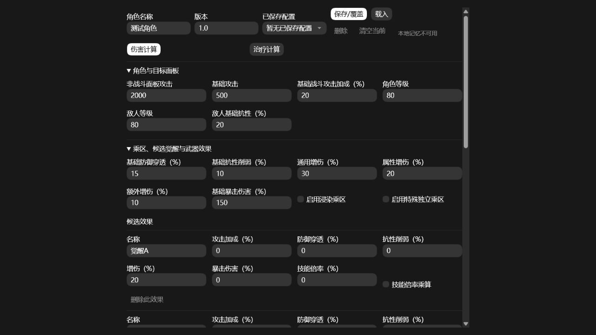
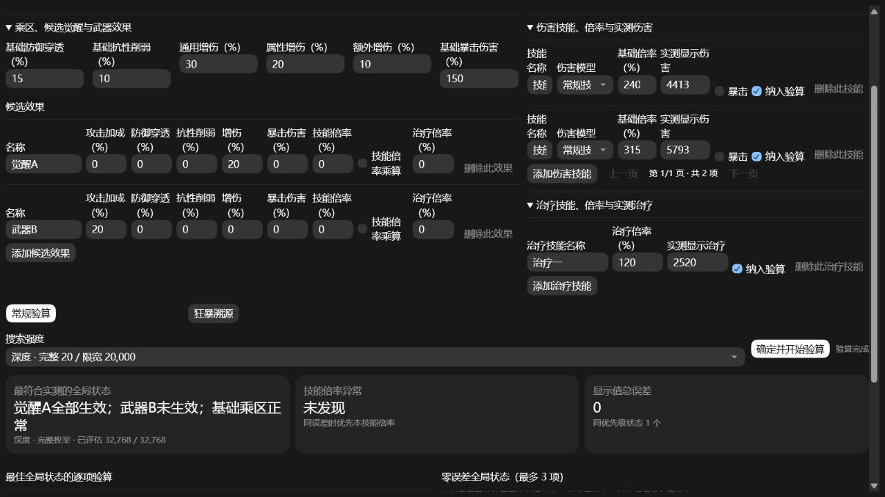
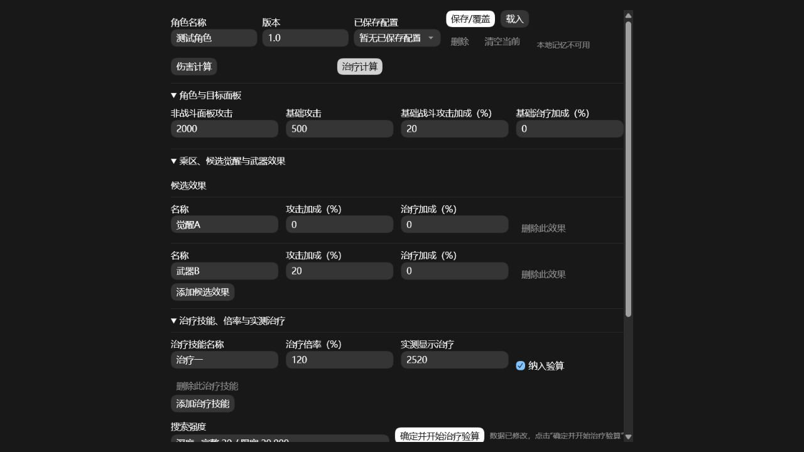
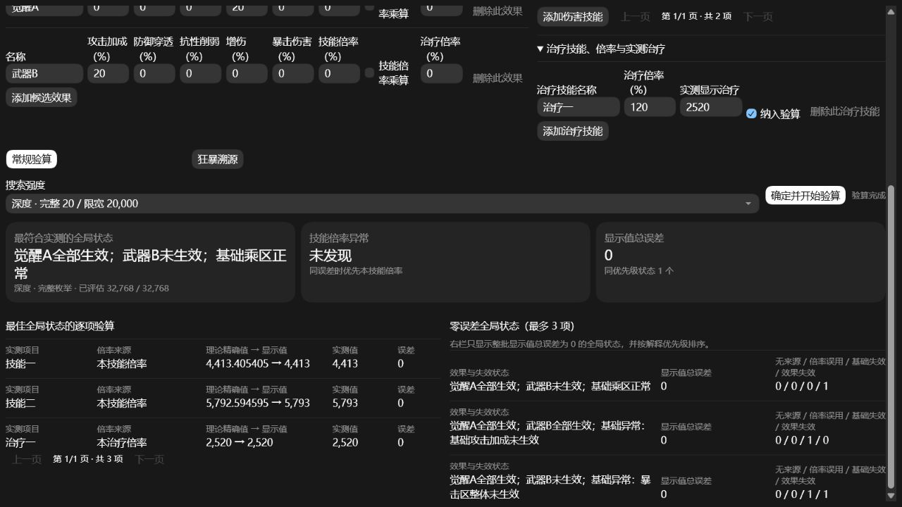
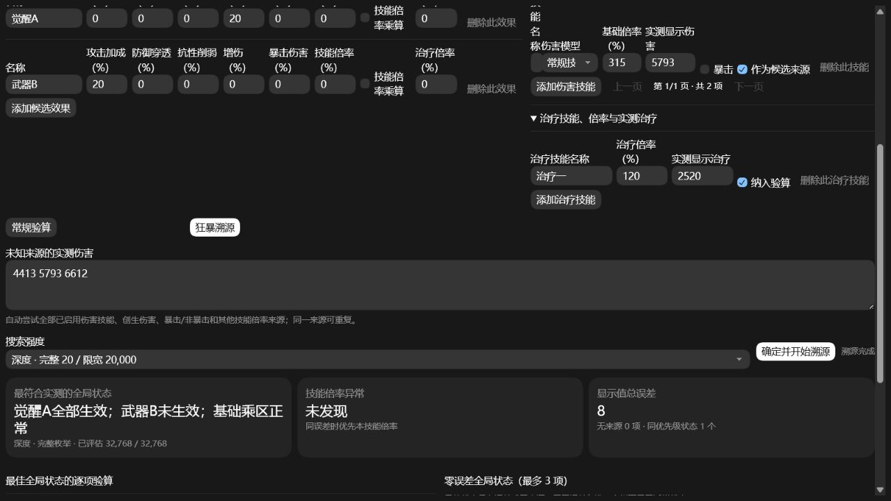

# 异环NTE数值验算器

一个完全离线的游戏测试辅助工具。它既能按公式正向计算伤害和治疗，也能把实测显示值反向交给多个生效/失效假设，寻找最合理的全局状态；还可以从一批不知道来源的跳字中反推技能、暴击状态和倍率来源。

仓库同时提供 Windows 桌面 EXE 和单文件 HTML。两者使用相同的计算与检索逻辑；EXE 的优势是独立窗口和固定的数据目录，并不意味着组合搜索会自动变成原生多线程程序。

## 直接使用

Windows 用户优先双击：

```text
dist/GameDamageCalculator.exe
```

EXE 不要求安装 Python，也不会打开外部浏览器。它使用 Windows 10/11 通常自带的 Microsoft Edge WebView2 Runtime。角色、版本和草稿保存在 `%LOCALAPPDATA%\GameDamageCalculator`。

也可以直接双击 `index.html` 使用单文件版。网页版本的数据保存在当前浏览器的本机存储中。若部署到静态托管服务，仓库根目录的 `index.html` 就是入口。

## 界面总览



界面按测试顺序从左到右、从上到下排列：

1. 选择或保存角色与版本；
2. 填写角色和目标面板；
3. 填写基础乘区和候选效果；
4. 记录伤害技能或治疗技能；
5. 伤害计算时选择常规验算或狂暴溯源，调整搜索强度并开始计算。

## 最快上手

### 已知技能来源：常规验算

在已知释放了何种技能后可以使用这一模式，确认伤害及各项增益是否正确。

1. 填写非战斗面板攻击、基础攻击、角色等级、敌人等级和基础抗性。
2. 填写当前构筑的基础乘区。
3. 将可能存在的觉醒、武器或其他临时效果逐条加入候选效果。
4. 添加一个或多个伤害技能，填写基础倍率、是否暴击及实测显示伤害。
5. 选择“常规验算”，通常保持“深度”搜索，点击“确定并开始验算”。

### 不知道跳字来源：狂暴溯源

在不知道是何种技能造成了伤害后可以使用这一模式。

1. 先完成同一角色、目标、效果和技能倍率的录入。
2. 勾选所有可能成为伤害来源的技能。
3. 选择“狂暴溯源”。
4. 把实测伤害用空格、逗号、中文逗号、分号或换行分隔后批量粘贴。
5. 点击“确定并开始溯源”。

同一批未知伤害必须共享同一套角色面板、敌人面板和全局增益状态。同一来源允许重复出现。

## 各区域填写规则

### 1. 角色与版本档案

| 字段或按钮 | 填写/操作规则 |
| --- | --- |
| 角色名称 | 用于区分角色档案，也会与版本一起组成保存键。 |
| 游戏版本 | 建议填写可复现的版本号，例如 `1.4.0`。同一角色可保存多个版本。 |
| 已保存配置 | 选择已经保存的“角色 + 版本”档案。 |
| 保存/覆盖 | 保存当前全部面板、效果、技能、模式和搜索强度；同名档案会覆盖。 |
| 载入 | 用所选档案替换当前输入。 |
| 删除 | 删除所选已保存档案。 |
| 清空当前 | 清空当前输入和自动草稿，但保留所有已保存档案。 |

未点击保存时，程序仍会自动记忆当前草稿。重要测试建议同时保留原始拉表数据，因为清理应用数据或浏览器站点数据会删除这些本地档案。

### 2. 角色与目标面板

| 字段 | 单位与含义 | 注意事项 |
| --- | --- | --- |
| 非战斗面板攻击 | 直接填写面板显示值 | 指未进入战斗时，在大世界环境下按 `C` 打开角色界面看到的最终面板。不要把战斗时由弧盘、觉醒、共鸣或队友提供的攻击加成预先算入。 |
| 基础攻击 | 直接填写数值 | 按“…”打开角色细节，面板攻击力左侧的白色数值记为基础攻击。它用于把战斗攻击加成换算成额外攻击。 |
| 基础战斗攻击加成 | 百分数，例如 `20` 代表 20% | 战斗攻击为“非战斗面板攻击 + 基础攻击 × 生效攻击加成总和”。 |
| 基础治疗加成 | 百分数 | 仅在“治疗计算”中显示，进入 `1 + 治疗加成` 区。 |
| 角色等级 | 整数 | 进入防御区公式。 |
| 敌人等级 | 整数 | 进入防御区公式。 |
| 敌人基础抗性 | 百分数，例如 `20` 代表 20% | 抗性区为 `1 - 基础抗性 + 抗性削弱`。敌人各属性抗性可参考[敌人数据表一](https://docs.qq.com/sheet/DUGxzWGhNc2RsZ3B0?tab=dfjfo3)和[敌人数据表二](https://docs.qq.com/sheet/DUFFaVGFDRmxaRUF6?tab=000001)。 测试建议选择高危委托6“何处是归乡”挑战，此怪物抗性为0.2|
| 基础环合强度 | 直接填写数值 | 只有存在创生花技能或启用浸染乘区时显示。 |

### 3. 基础乘区

基础乘区表示不依赖候选觉醒、被动、共鸣、弧盘或队友 Buff，仅当前面板原本就应存在的数值。所有百分数字段直接输入百分数，不需要输入 `%`。

| 字段 | 计算方式 |
| --- | --- |
| 防御穿透 | 填 `20` 即按 `0.20` 进入防御区。 |
| 抗性削弱 | 与抗性区加算。 |
| 通用增伤 | 进入增伤区并与其他增伤相加。 |
| 属性增伤 | 进入增伤区并与其他增伤相加。 |
| 额外增伤 | 进入增伤区并与其他增伤相加。 |
| 暴击伤害 | 填写最终暴击倍率的百分数，例如 `150` 代表暴击时乘 `1.5`。 |
| 启用浸染乘区 | 勾选后，常规伤害额外乘以 `1.2 × 最终环合强度 / 600`。不作用于创生花。 |
| 启用特殊独立乘区 | 勾选后显示“特殊独立倍率（倍）”，直接填写如 `1.2`。不作用于创生花。 |

增伤区自动带基础倍率 `1`：`1 + 通用 + 属性 + 额外 + 生效候选增伤`。反向验算会同时考虑单个基础数值未生效和整个基础乘区未生效。

### 4. 候选觉醒、武器与其他效果

每一行代表一个可以独立判断生效或失效的候选效果。名称应能直接定位来源，例如“觉醒3”“专武2星”“队友光环”。同一行可同时填写多个提升，代表它们共享该行的整体生效状态；程序也会继续检查行内单项提升是否未生效。

| 字段 | 作用 |
| --- | --- |
| 攻击加成 | 与其他战斗攻击加成相加，再乘基础攻击后加入面板攻击。 |
| 防御穿透 | 加入防御穿透总和。 |
| 抗性削弱 | 加入抗性削弱总和。 |
| 增伤 | 加入增伤区。 |
| 暴击伤害 | 加入暴击伤害倍率。 |
| 技能倍率 | 默认与技能基础倍率加算。 |
| 技能倍率乘算 | 勾选后改为把该项按 `基础倍率 × (1 + 提升)` 处理；多个乘算项会连乘。 |
| 环合强度提升 | 百分比提升，按 `基础环合强度 × (1 + 百分比提升)` 计算。只在需要环合强度时显示。 |
| 环合强度固定提升 | 在百分比提升后加上固定数值 `+x`。只在需要环合强度时显示。 |
| 治疗加成 | 加入 `1 + 治疗加成` 区，只在治疗计算中显示。 |

数值为 `0` 的字段不会形成独立判断项。候选越多，理论状态数按 `2^N` 增长。

### 5. 伤害技能



| 字段 | 填写规则 |
| --- | --- |
| 技能名称 | 自定义名称，建议与游戏内名称一致。 |
| 伤害模型 | “常规”使用完整攻击、乘区和倍率公式；“创生”使用固定基础值 9000 和环合强度修正。 |
| 基础倍率 | 百分数，例如 `240` 代表 `2.40`；创生伤害不读取此值。 |
| 实测显示伤害 | 填游戏最终显示的整数，不是计算器内部小数。 |
| 暴击 | 常规验算时表示该条实测值是否暴击。 |
| 作为候选来源 | 决定该技能是否进入狂暴溯源的来源池。 |

可以记录多个技能。常规验算优先使用本技能倍率，但也会尝试其他已记录技能倍率，以检查曾经出现过的“误用其他技能倍率”问题。

### 6. 治疗技能

点击顶部“治疗计算”后，伤害乘区、敌人面板和伤害技能会自动隐藏，只保留攻击面板、基础治疗加成、候选攻击/治疗加成和治疗技能。填写治疗倍率和实测显示治疗后勾选“纳入验算”。



## 计算公式

### 常规伤害

```text
战斗攻击 = 非战斗面板攻击 + 基础攻击 × 生效攻击加成总和

非暴击伤害 = 战斗攻击 × 防御区 × 抗性区 × 增伤区 × 技能倍率
               × 浸染乘区（若启用）× 特殊独立乘区（若启用）
暴击伤害   = 非暴击伤害 × 暴击伤害倍率
```

### 创生伤害

```text
最终环合强度 = 基础环合强度 × (1 + 生效百分比提升) + 生效固定提升
非暴击创生 = 9000 × 防御区 × 抗性区 × (1 + 最终环合强度 / 600)
暴击创生   = 非暴击创生 × 暴击伤害倍率
```

创生花不读取面板攻击、常规增伤区、普通技能倍率、浸染乘区或特殊独立乘区。

### 治疗

```text
治疗值 = 战斗面板攻击 × 治疗倍率 × (1 + 生效治疗加成总和)
```

伤害技能的防御区、抗性区、增伤区、暴击区、浸染和特殊独立乘区均不作用于治疗。更完整的百分数、加算/乘算及失效规则见[计算公式](docs/formulas.md)。

## 搜索强度与性能

| 档位 | 完整枚举上限 | 超过上限后的限宽 | 建议用途 |
| --- | ---: | ---: | --- |
| 标准 | 18 个判断项（262,144 个状态） | 5,000 | 快速反复改数值。 |
| 深度 | 20 个判断项（1,048,576 个状态） | 20,000 | 默认档，正式验算。 |
| 极限 | 22 个判断项（4,194,304 个状态） | 50,000 | 最终排查，接受较长等待。 |

在完整枚举上限以内，程序确实会评估全部 `2^N` 个状态，不会因为只显示少量结果而漏掉更优组合。为控制内存，枚举过程中只保留排序最好的 300 个解释；这不会改变第一名和界面显示的前三个零误差状态。

超过对应上限后会从“全部生效”开始逐项排除，并只保留当前最好的若干路径。此时不是穷举，仍可能漏掉路径。界面会明确显示“完整枚举”或“全生效起点逐项排除”，以及已评估状态数与理论总状态数。

EXE 与 HTML 都在 WebView2/浏览器的 JavaScript 主线程中计算。打包成 EXE 可以改善使用体验，但不会自动消除卡顿；极限档在数百万状态或复杂狂暴溯源下可能暂时无响应。建议先用深度档整理输入，确认需要更广范围后再切到极限档，并等待按钮旁出现“验算完成”或“溯源完成”。

## 常规验算结果怎么读



“最符合实测的全局状态”是整批实测值共同使用的一套假设，不是某一条伤害的来源。它会说明哪些基础乘区正常或失效、哪些候选效果生效或失效，并按以下固定规则排序：

1. 超过 ±20 或没有来源的条目更少；
2. 相对误差总和更小；
3. 基础乘区失效更少；
4. 误用其他技能倍率更少；
5. 候选觉醒和武器失效更少。

这表示“解释优先级”，不是统计学概率或百分比置信度。

| 结果字段 | 含义 |
| --- | --- |
| 理论精确值 | 保留小数的内部计算值。 |
| 理论显示值 | 精确值按游戏显示规则四舍五入后的整数。 |
| 误差 | `|理论显示值 - 实测显示值|`。 |
| 显示值总误差 | 本批全部条目的显示值误差之和。 |
| 零误差全局状态 | 只显示整批总误差为 0 且没有无来源条目的状态，最多 3 项。 |

如果不存在零误差状态，顶部仍会显示总体最接近的状态用于诊断，但不会把带误差的次优状态塞进“零误差全局状态”列表。

## 狂暴溯源结果怎么读



狂暴溯源会为每条未知伤害尝试：

- 所有勾选为候选来源的常规技能；
- 创生花伤害及其环合强度修正；
- 暴击和非暴击；
- 本技能倍率和其他已记录技能倍率；
- 同一套基础乘区、觉醒和武器生效/失效状态。

“±20 内来源数”表示在当前最佳全局状态下，该条未知伤害有多少个“技能 × 暴击状态 × 倍率来源”落在 ±20 内。数字越大代表来源歧义越多，并不代表该全局状态更可信。没有任何候选落入 ±20 时会显示“无来源”，程序不会拿几十或几百误差的结果强行解释。

## 数据保存与隐私

全部计算和保存都在本机完成，不会上传面板或实测数据，也不会把个人档案写入 Git 仓库。

- 桌面版：`%LOCALAPPDATA%\GameDamageCalculator`
- HTML 版：打开它的浏览器本机存储

删除桌面版应用数据目录，或清理网页版本的站点数据后，已保存配置会丢失。

## 项目结构

```text
game-damage-calculator/
├─ dist/
│  └─ GameDamageCalculator.exe # Windows 桌面版
├─ desktop/
│  ├─ main.py                  # 桌面壳入口
│  ├─ build.ps1                # EXE 构建脚本
│  └─ requirements-build.txt   # 固定版本的构建依赖
├─ docs/
│  ├─ formulas.md              # 计算公式与排序规则
│  └─ images/                  # README 实机截图
├─ scripts/
│  └─ check-fragment.mjs       # 界面脚本语法自检
├─ src/
│  └─ app.fragment.html        # 可读的界面与计算逻辑源文件
├─ index.html                  # 可直接运行和部署的单文件版本
├─ LICENSE                     # MIT License
├─ README.md
└─ CHANGELOG.md
```

## 重新构建 EXE

需要 Windows、Python 3.13 以及可联网安装依赖的环境。在仓库根目录运行：

```powershell
python -m venv .venv
.\.venv\Scripts\python.exe -m pip install -r .\desktop\requirements-build.txt
powershell -NoProfile -ExecutionPolicy Bypass -File .\desktop\build.ps1
```

输出文件为 `dist/GameDamageCalculator.exe`。每次修改 `index.html` 后重新执行最后一条命令即可。

## 开源

本项目采用 [MIT License](LICENSE)。
